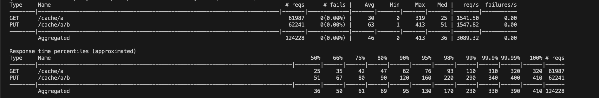

## Docker compose

```bash
$ docker-compose up --build
```
This will start 3 cache servers and zookeeper.
The servers can be accessed from 
```bash
http://localhost:3000/
http://localhost:3001/
http://localhost:3002/
```
PLEASENOTE THE DIFFERENT PORTS FOR THE CACHE SERVERS

### View members in cluster
```bash
http://localhost:3000/admin/members
```
should return something like this: 
```bash
{
  "cache-0000000038": "3001",
  "cache-0000000039": "2999",
  "cache-0000000040": "3000",
  "cache-0000000037": "3002",
  "cache-0000000032": "3009",
}
```
Each of these is a cache seerver running and registered with Zookeeper.

### Add to Cache
```bash
PUT http://localhost:3001/cache/foo/bar
```
```
{
  "key": "foo",
  "value": "bar",
  "expiration": 1741314113714
}

```
### Get fromCache
```bash
Get http://localhost:3001/cache/foo
```
```
{
  "key": "foo",
  "value": "bar",
  "expiration": 1741314113714
}

```
### View vbuckets in a cache server
```bash
http://localhost:3001/admin/vbuckets
```
This will Show all the vbuckets in the cache server.
```
{
  "0": {},
  "1": {},
  "2": {},
  "3": {},
  "4": {
    "foo": {
      "key": "foo",
      "value": "bar",
      "expiration": 1741314113714
    }
  },
  "5": {},
  ...
}
```

## Smart Client
This is currently the locust.py file in the misc directory. Locust.io uis needed to run the smart client and load test
```bash
locust -h -u 10000 -r 100 -t 40 -f cache/locust.py --host localhost --processes 5
```

Result will look like this



```
Type     Name                                                                          # reqs      # fails |    Avg     Min     Max    Med |   req/s  failures/s
--------|----------------------------------------------------------------------------|-------|-------------|-------|-------|-------|-------|--------|-----------
GET      /cache/a                                                                       61987     0(0.00%) |     30       0     319     25 | 1541.50        0.00
PUT      /cache/a/b                                                                     62241     0(0.00%) |     63       1     413     51 | 1547.82        0.00
--------|----------------------------------------------------------------------------|-------|-------------|-------|-------|-------|-------|--------|-----------
         Aggregated                                                                    124228     0(0.00%) |     46       0     413     36 | 3089.32        0.00

Response time percentiles (approximated)
Type     Name                                                                                  50%    66%    75%    80%    90%    95%    98%    99%  99.9% 99.99%   100% # reqs
--------|--------------------------------------------------------------------------------|--------|------|------|------|------|------|------|------|------|------|------|------
GET      /cache/a                                                                               25     35     42     47     62     76     93    110    310    320    320  61987
PUT      /cache/a/b                                                                             51     67     80     90    120    160    220    290    340    400    410  62241
--------|--------------------------------------------------------------------------------|--------|------|------|------|------|------|------|------|------|------|------|------
         Aggregated  
         ```